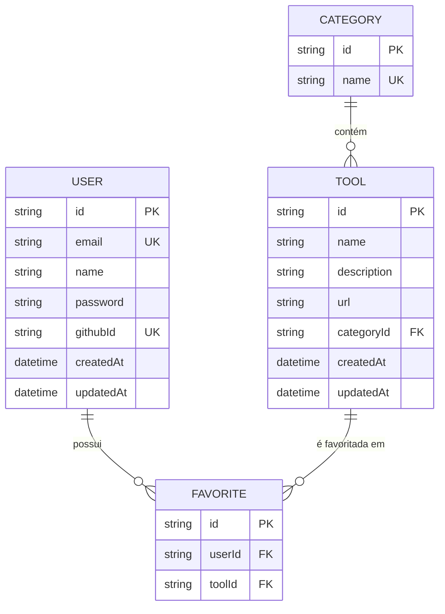

# Modelagem do Banco de Dados 🗄️

Este documento descreve a modelagem lógica e relacional do banco de dados do **Arsenal DEV**, gerenciado via **Prisma ORM** e rodando em um container **PostgreSQL**.

---

## 📊 Diagrama de Entidade-Relacionamento (ERD)

Abaixo está a representação visual dos relacionamentos utilizando Mermaid:

---

## 🗂️ Descrição das Tabelas e Campos

### 1. `User` (Usuários)
Armazena as informações das contas dos desenvolvedores cadastrados na plataforma.

| Campo | Tipo | Restrições | Descrição |
| :--- | :--- | :--- | :--- |
| `id` | `String (UUID)` | `PK`, `Default: uuid()` | Identificador único do usuário. |
| `email` | `String` | `Unique`, `Required` | E-mail do usuário utilizado para login. |
| `name` | `String` | `Optional` | Nome completo ou exibição do usuário. |
| `password` | `String` | `Optional` | Hash da senha de login (criptografado via bcrypt). |
| `githubId` | `String` | `Unique`, `Optional` | ID do GitHub caso o login seja via OAuth. |
| `createdAt` | `DateTime` | `Required`, `Default: now()` | Data e hora de criação da conta. |
| `updatedAt` | `DateTime` | `Required`, `Update` | Data e hora da última atualização dos dados. |

---

### 2. `Tool` (Ferramentas)
Armazena as ferramentas (softwares, libs, serviços) cadastradas no ecossistema do Arsenal.

| Campo | Tipo | Restrições | Descrição |
| :--- | :--- | :--- | :--- |
| `id` | `String (UUID)` | `PK`, `Default: uuid()` | Identificador único da ferramenta. |
| `name` | `String` | `Required` | Nome da ferramenta (ex: "VS Code", "Prisma"). |
| `description` | `String` | `Required` | Breve descrição da utilidade da ferramenta. |
| `url` | `String` | `Required` | URL/Link oficial da ferramenta. |
| `categoryId` | `String (UUID)` | `FK` | Chave estrangeira ligada à tabela `Category`. |
| `createdAt` | `DateTime` | `Required`, `Default: now()` | Data e hora em que a ferramenta foi adicionada. |
| `updatedAt` | `DateTime` | `Required`, `Update` | Data e hora de alteração do registro. |

---

### 3. `Category` (Categorias)
Categoriza as ferramentas para facilitar a busca e organização (ex: "IDE", "Database", "DevOps").

| Campo | Tipo | Restrições | Descrição |
| :--- | :--- | :--- | :--- |
| `id` | `String (UUID)` | `PK`, `Default: uuid()` | Identificador único da categoria. |
| `name` | `String` | `Unique`, `Required` | Nome único da categoria. |

---

### 4. `Favorite` (Favoritos)
Tabela pivot que gerencia a relação N:N (Muitos-para-Muitos) entre `User` e `Tool`. Ela garante que um usuário possa ter várias ferramentas favoritas e que cada ferramenta possa ser favoritada por múltiplos usuários.

| Campo | Tipo | Restrições | Descrição |
| :--- | :--- | :--- | :--- |
| `id` | `String (UUID)` | `PK`, `Default: uuid()` | Identificador único do favorito. |
| `userId` | `String (UUID)` | `FK`, `Required` | Chave estrangeira ligada à tabela `User`. |
| `toolId` | `String (UUID)` | `FK`, `Required` | Chave estrangeira ligada à tabela `Tool`. |

> **Nota:** Existe uma constraint única composta `@@unique([userId, toolId])` que impede fisicamente que o mesmo usuário favorite o mesmo item mais de uma vez.

---

## ⚙️ Configuração Técnica (Prisma Client)

As migrations geradas criam as tabelas e aplicam chaves estrangeiras com comportamento restrito nativo do PostgreSQL.
O arquivo completo de configuração da modelagem pode ser encontrado no diretório:
`apps/api/prisma/schema.prisma`
